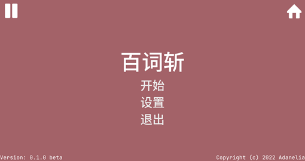
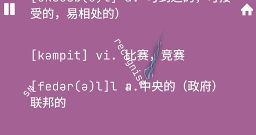

# Shatter That Word

A mobile game.

Swiping your finger to shatter words!

No longer maintain.

*Made with [Godot3](https://godotengine.org/).*

*使用[Godot3](https://godotengine.org/)开发*

详情见[Taptap](https://www.taptap.cn/app/231114)。  
精力有限，此项目不再维护，大家可以自行查看或修改源代码。

## License

MIT License.

### Third party

Godot Engine (https://godotengine.org/license)

SuperLightning (https://github.com/DeanNevan/Godot-2D-Super-Lightning)  
MIT License

JetBrainsMono-2.225  
Copyright 2020 The JetBrains Mono Project Authors (https://github.com/JetBrains/JetBrainsMono)

SourceHanSansCN  
Copyright 2014-2021 Adobe (http://www.adobe.com/), with Reserved Font Name 'Source'. Source is a trademark of Adobe in the United States and/or other countries.
This Font Software is licensed under the SIL Open Font License, Version 1.1.
